# 祥龙-答题

## 2021-11-30

1.

该目录下创建django工程文件

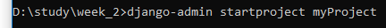

创建app

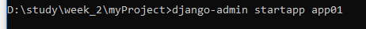

初始化数据库

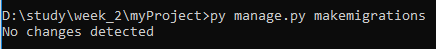

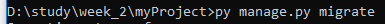

测试运行

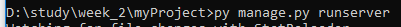

### 1.1、有一个测试api，可以拿到数据库的数据，json格式 

分析：1，拿到数据库数据，再进行json格式化，最后设置路由api

#### 设置数据库

进入app01/models.py,

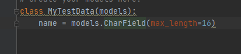

由于忘了字段名字的名称，进入CharField源码中查找该字段名称

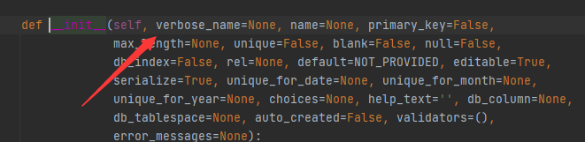

找到名称

创建完数据库

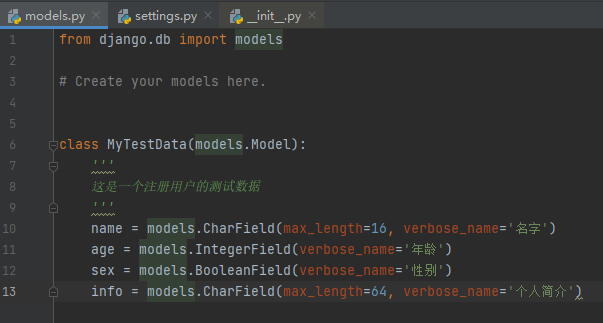

在settings.py设置应用

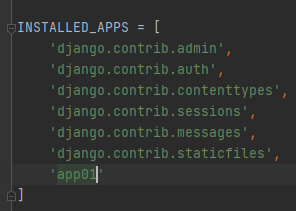

更新

> py manage.py makemigrations
>
> py manage.py migrate

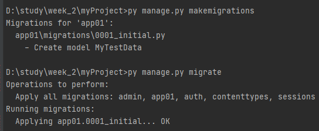

#### 设置视窗

views.py

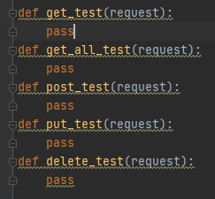

先设置好模板

先简单写好测试内容

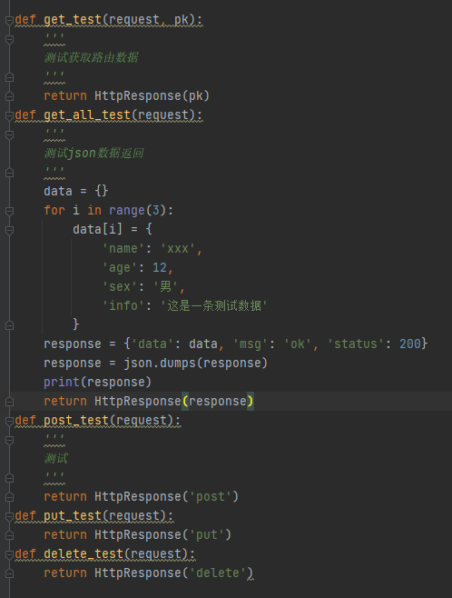

#### 设置路由映射api

settings.py

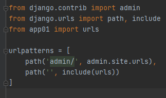

​	ps: 不加前缀包含给其他url不需要加斜杠

app01下创建urls.py 文件，复制模板过去

修改文件

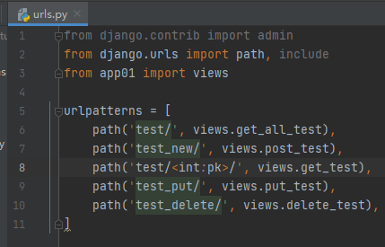

#### 测试

1. json数据的返回

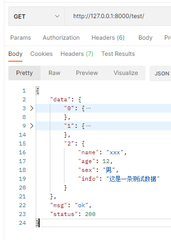

2. 路由id

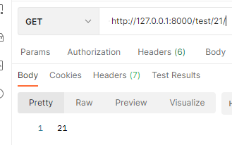

3. 其他方法

ps: 测试post需要先把csrf关了

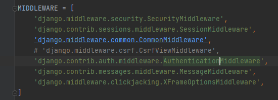

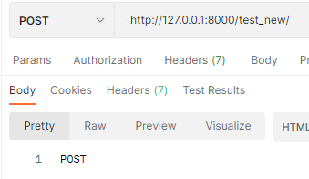

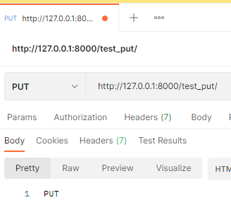

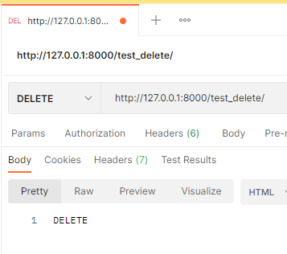

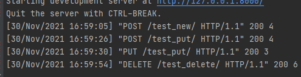

#### post_test方法完成

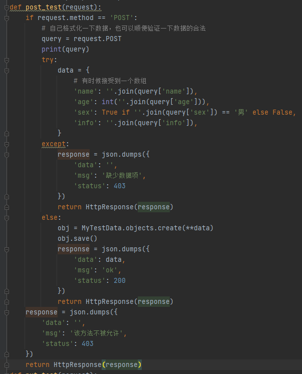

##### post_test方法测试

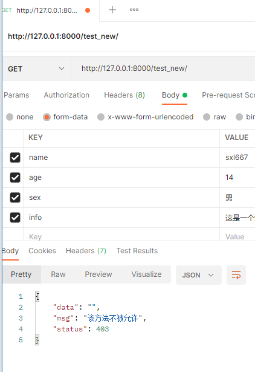

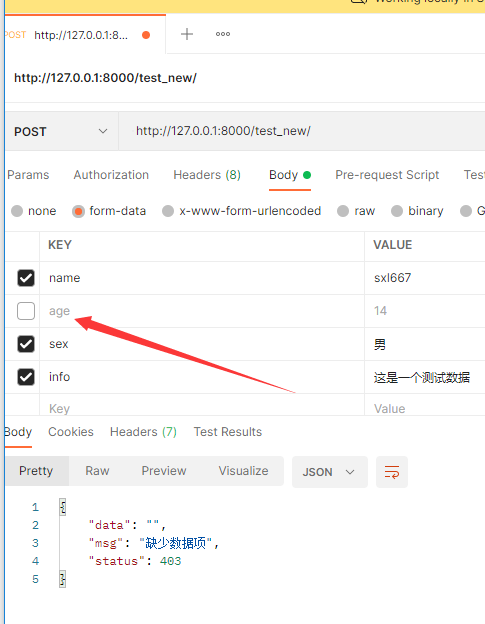

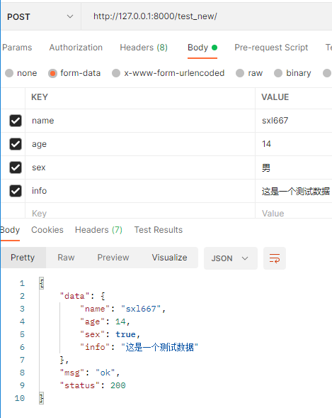

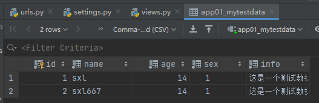

#### get_all_test方法完成

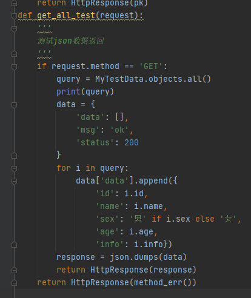

##### 添加使用错误方法访问API方法

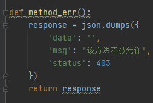

##### get_all_test方法测试

post方法访问

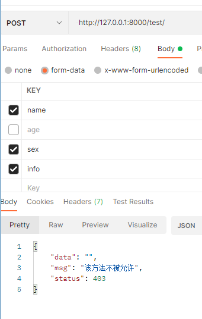

正常访问

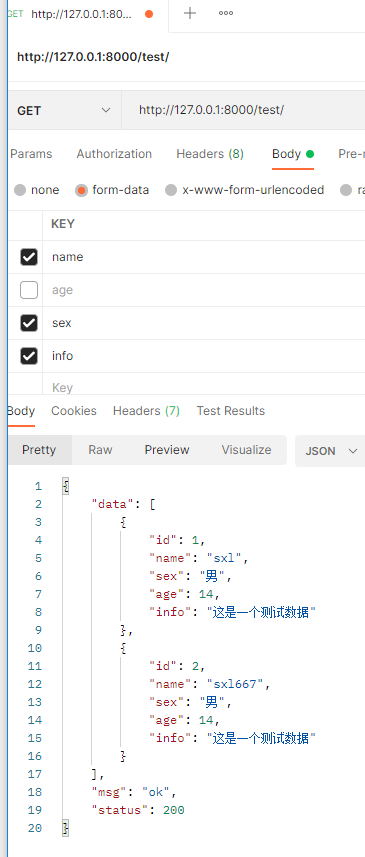

