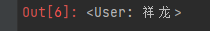
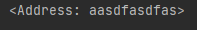
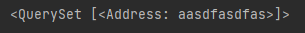
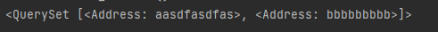
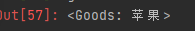
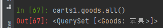
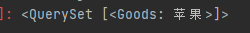
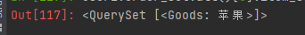

# django models练习

1. 创建用户表，地址表，商品表，购物车表，订单表
2. 使用一对多，多对多进行外键连接

查询练习

> tip : 用户自主查询一般是指只有用户的某一个信息进行的查询
>
> 如用户查询某某某，需先查询出用户，再从该用户对象中查询出其他信息

3. 新建一个用户
4. 展示用户的修改时间
5. 该用户创建了一个地址
6. 用户查询自己的地址 
7. 用户又添加了一个地址
8. 用户删除了地址bbbb
9. 添加一个商品
10. 用户将2份苹果加入购物车
11. 用户查询购物车
12. 用户购买了购物车
    1. 第一个操作添加订单，
    2. 购物车相应物品被删除
13. 用户查询所有订单

